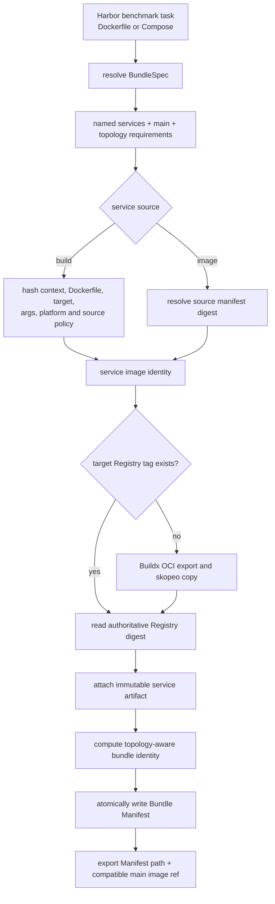

# OpenSandbox Bundle and Image Management

## Summary

The image layer represents every local Harbor benchmark framework task as a
versioned Bundle:

- `compose_bundle.py` normalizes a single Dockerfile into an implicit `main`
  service, or parses a Compose definition into named services and topology;
- `opensandbox_image_manager.py` prepares one content-addressed Registry image
  per distinct service image input and atomically writes the Bundle Manifest;
- `harboropik.sh` exports both the Manifest path and the legacy main image ref;
- `prebuild_opensandbox_dataset.sh` writes one Manifest per task while retaining
  resumable Registry cache behavior.

This layer does not create Sandbox instances, run health checks, or schedule
service dependencies. Those operations belong to the Environment runtime.

## Flow



The integration entry point is
[`prepare_opensandbox_image_ref`](harboropik.sh). The main workflow
is implemented by [`prepare`](opensandbox_image_manager.py).

## Input normalization

One code path handles both formats:

| Task definition | Normalized result |
| --- | --- |
| `environment/Dockerfile` | One implicit service named `main` |
| `environment/docker-compose.yaml` or `.yml` | Named services; a `main` service is required |

The restricted Compose loader currently supports `build.context`,
`build.dockerfile`, `build.args`, `build.target`, `image`, `entrypoint`,
`command`, `environment`, `ports`, `expose`, aliases, `depends_on`, `healthcheck`,
volumes, networks, `cap_add`, and `privileged`. Build paths are resolved and
must remain inside the task environment. Unsupported build fields fail before
any image is built.

The loader records requirements such as multiple services, shared volumes,
fixed IPs, multiple networks, capabilities, and privileged execution. Recording
a requirement does not imply that OpenSandbox can satisfy it; the runtime
capability gate is part of the separate scheduling implementation.

## Identity and cache contract

Service image identity and Bundle identity are intentionally separate.
Changing only a port or dependency updates the Bundle without rebuilding an
otherwise unchanged image.

For a built service, image identity covers:

```text
build-context content hash
+ Dockerfile path and content
+ build target and build args
+ Docker/APT source policy
+ target platform
```

For an `image:` service, the source manifest body digest replaces the build
input hash. The image is republished through the managed Registry flow so that
OpenSandbox receives the materialized image's digest ref.

Harbor 镜像仓库 addressing is explicit:

```text
Project = benchmark
Repository = normalized task identity
tag = <service>-<short-input-hash>
digest ref = <registry>/<project>/<task>@sha256:<artifact-digest>
```

The `input_hash` is a full SHA-256 calculated before build and the Registry
`artifact_digest` is collected by an independent `skopeo inspect` after copy.
The cache authority is the target task repository, not a local record. Equal
service image inputs in one Bundle create a service-tag alias for the same
artifact. The manager does not implement Registry Project management, raw blob
upload, an old-Registry fallback, or a cross-repository layer index.

The current context hash is conservative: generated cache files are ignored,
but `.dockerignore` is not yet evaluated. This can cause an unnecessary rebuild
when an ignored file changes, but cannot incorrectly reuse a stale image.

## Bundle Manifest contract

The JSON Manifest includes:

- schema v2 `benchmark`, `task_identity`, and `registry` metadata;
- stable definition and Bundle identities;
- `main` and all named service records;
- full `input_hash`, tag/tag ref, Artifact digest, and digest ref;
- image config (`Entrypoint`, `Cmd`, `ExposedPorts`, healthcheck), Compose
  override presence, environment, ports/expose, aliases, dependency and
  healthcheck topology;
- materialized `runtime.start_argv`, `runtime.internal_ports`, and
  `runtime.readiness`, each with an auditable source where applicable.
- volume, network, capability, and unsupported-feature requirements.

Build argument values are included in the image identity but are not written to
the Manifest or local record. Credentials come from the ignored
`YICLOUD_HARBOR_USERNAME`/`YICLOUD_HARBOR_PASSWORD` environment (or an existing
Docker config fallback) and are never written to Bundle files. Sandbox tokens
and model credentials are outside this layer.

`SkopeoPublisher` removes ambient HTTP(S) proxy variables for login, copy, and
inspect. TLS verification is controlled by `YICLOUD_HARBOR_TLS_VERIFY`; the
currently verified internal ingress requires `0`, but this is configuration,
not a global default for all registries.

Each publisher owns a private temporary `skopeo` authfile. Parallel prebuild
workers must never share the XDG runtime authfile, because concurrent `skopeo
login` writes can corrupt it. The private authfile is removed after publishing.

For local builds the manager reads the OCI archive config blob before the
temporary archive is discarded. Cache hits and external `image:` services use
`skopeo inspect --config`. It never derives runtime ports or default commands
by scanning Dockerfile text.

## CLI and compatibility

The normal integration calls:

```text
opensandbox_image_manager.py ... \
  --bundle-manifest-output <task-job>/<attempt>/opensandbox-bundle.json
```

Stdout defaults to the `main` image ref for existing callers. `--output
bundle-manifest` and `--output json` expose the new contracts directly.

`harboropik.sh` sets:

```text
HARBOR_OPENSANDBOX_BUNDLE_MANIFEST=<absolute path>
HARBOR_OPENSANDBOX_IMAGE_REF=<main digest_ref>
```

An explicitly supplied Bundle takes precedence and can supply the main ref. An
explicit image ref without a Bundle retains the old single-image behavior.

## Unified APT Gateway

Task image builds require one explicitly configured APT Gateway root:

```bash
HARBOR_OPENSANDBOX_APT_MIRROR=http://<INTERNAL_GATEWAY>/v1/cache
```

The image manager appends the allowlisted source name to that root. Ubuntu,
Debian, Debian Security, and Docker CE therefore resolve through
`/v1/cache/ubuntu/`, `/v1/cache/debian/`, `/v1/cache/debian-security/`, and
`/v1/cache/docker-ce/`. The root is part of `SourcePolicy.identity`, so changing
the Gateway invalidates the previous task-image build identity.

A loopback Gateway such as `http://127.0.0.1:8080/v1/cache` is accepted only
with `HARBOR_OPENSANDBOX_BUILD_NETWORK=host`. It is suitable for a Gateway on
the same development machine, but it is not a shared YiCloud endpoint. Other
build machines must use an internal Gateway domain or Service reachable from
their BuildKit execution environment. Missing configuration and loopback with
a non-host build network fail before the image build starts.

Package names do not select third-party sources. A future third-party rewrite
must scan the current task Dockerfile and referenced scripts, then exactly
match an `upstream_url` from `apt-gateway-plan.json`. In particular,
`packages_in_same_tasks` and the report's limited `examples` are context only;
NodeSource `setup_18.x` requires a semantic rewrite because the script writes
its own repository URL.

## Current boundary

- Image preparation and Bundle handoff are implemented for local tasks.
- `YiCloudOpenSandboxEnvironment` consumes schema v2 (and reads schema v1 for
  migration): it gates unsupported capabilities before creation, creates the
  service group, wires a managed `/etc/hosts` block, checks healthchecks, and
  routes the Harbor benchmark framework's default file and exec operations to
  `main`.
- `service_exec(name, ...)` and `stop_service(name)` target an explicit
  sidecar. Group startup failure and `stop(delete=True)` clean up all recorded
  Sandbox IDs.
- The parser is a deliberately restricted PyYAML loader, not a complete Docker
  Compose implementation. Compose merge, profiles, configs, secrets, and other
  unlisted semantics must be added or rejected explicitly before relying on
  them.
- The configured Docker mirror and unified APT Gateway are part of the source
  policy. Proxy build args are forwarded only when explicitly enabled.
- `--force` bypasses the target-tag cache lookup; it does not change the
  deterministic tag or the image content identity.
