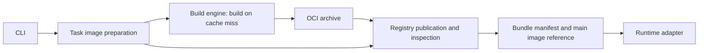

# Harbor task image manager

This package prepares Registry images for a Harbor task and writes a versioned
Bundle manifest containing immutable service image references and runtime
configuration. It supports both single-Dockerfile and Compose tasks.

[`task_cli.py`](task_cli.py) prepares one task;
[`dataset_cli.py`](dataset_cli.py) prepares a dataset. Image preparation ends when
the manifest and main image reference are returned; the runtime adapter owns
Sandbox creation.

## Modules

| Module | Responsibility | Documentation |
| --- | --- | --- |
| `task_cli.py` | Prepare one task and report its Bundle or main image reference | [Task CLI](#task-cli) |
| `dataset_cli.py` | Discover tasks, schedule bounded concurrent preparation, handle failures, and manage batch GC and summaries | [Dataset prebuild](#dataset-prebuild) |
| `prebuild_dataset.sh` | Load repository configuration, select Python, and exec the dataset CLI | [Dataset prebuild](#dataset-prebuild) |
| `task_bundle/` | Define the Bundle abstraction and assemble manifest data without I/O | [Task Bundle](task_bundle/README.md) |
| `build_sources.py` | Select build sources once after local cache resolution | [Automatic Gateway routing](#automatic-gateway-routing) |
| `source_urls.py` | Validate shared build-source URL and network-scope requirements | [Build engine](build_engine/README.md) |
| `dependency_gateway.py` | Probe the configured Gateway and map its source routes | [Automatic Gateway routing](#automatic-gateway-routing) |
| `task_preparation.py` | Orchestrate all service images for one task and persist its Bundle | [Task Bundle boundaries](task_bundle/README.md#modules-and-boundaries) |
| `service_images.py` | Resolve, build, and publish one service image | [Build engine](build_engine/README.md) |
| `uploaded_bundle_cache.py` | Own uploaded-Bundle cache reads, reuse policy, restoration, and persistence | [Identity and cache](task_bundle/README.md#identity-and-cache) |
| `task_image_identity.py` | Hash original task environment inputs | [Identity and cache](task_bundle/README.md#identity-and-cache) |
| `oci.py` | Read OCI archives and normalize image metadata | [Task Bundle boundaries](task_bundle/README.md#modules-and-boundaries) |
| `build_engine/` | Render build inputs and execute a single image build | [Build engine](build_engine/README.md) |
| `registry.py` | Copy images with Skopeo, inspect remote images, and verify published digests | [Identity and cache](task_bundle/README.md#identity-and-cache) |
| `image_build_state.py` | Manage local image build locks, records, and log paths | [Identity and cache](task_bundle/README.md#identity-and-cache) |

Dataset batching and BuildKit cache pruning are handled by
[`dataset_cli.py`](dataset_cli.py).

## Lifecycle



A reusable uploaded-Bundle index can return the recorded result before this
Registry/build path. See [Task Bundle](task_bundle/README.md) for normalization,
cache validation, manifest consumers, and recovery after moving machines.
See [Build engine](build_engine/README.md) for build inputs, rendering
strategies, and the BuildKit frontend.

## Task CLI

Integration calls the CLI directly:

```text
python /path/to/Harbor/task_image_manager/task_cli.py ... \
  --bundle-manifest-output <task-job>/<attempt>/opensandbox-bundle.json
```

Stdout defaults to the `main` digest reference. `--output bundle-manifest`
prints the manifest path. `--output json` prints the manifest path, main
reference, and Bundle identity. In dry-run mode, `bundle-manifest` requires
`--bundle-manifest-output`.

`harboropik.sh` exports:

```text
HARBOR_OPENSANDBOX_BUNDLE_MANIFEST=<absolute path>
HARBOR_OPENSANDBOX_IMAGE_REF=<main digest_ref>
```

An explicitly supplied Bundle takes precedence and can supply the main
reference. An explicit image reference without a Bundle keeps single-image
behavior. Both forms use fully qualified references under the configured
`YICLOUD_HARBOR_HOST`. The provider rejects bare references and other
registries before creating a Sandbox.

## Automatic Gateway routing

Set `DEPENDENCY_GATEWAY_URL` to the service origin or its `/v1/cache` root:

```bash
export DEPENDENCY_GATEWAY_URL=https://gateway.example/v1/cache
```

Both task and dataset preparation probe `/healthz` before selecting Gateway
sources. The request bypasses ambient HTTP proxies and requires HTTP 200 with
`{"status":"ok"}`. The default timeout is five seconds, configurable with
`HARBOR_TASK_IMAGE_GATEWAY_TIMEOUT_SEC` or `--dependency-gateway-timeout-sec`
(up to 60 seconds). The health check establishes host-side service reachability;
it does not prove every upstream package is available or that a remote BuildKit
worker can reach the service. Use a build-reachable address; loopback requires
`--build-network=host`.

When reachable, Gateway routes override the current package, Git, APT and
curl/wget source settings for that preparation attempt. The mappings follow the
[dependency-gateway client contract](../../../../../third_party/dependency-gateway/README.md).
Docker Hub and base-image Registry settings remain separate: the HTTP Gateway
does not proxy OCI image pulls.

When the health check fails, preparation keeps the original source settings,
including caller-supplied mirrors and existing defaults. Source selection runs
once per preparation attempt. Subsequent build, Registry, or manifest failures
propagate without switching sources or restarting the task. Overrides never
mutate shared settings across concurrent tasks and do not enter task image identity.

Local uploaded-Bundle cache hits and dry-run skip source probes entirely.
`--dependency-gateway-url` overrides the environment; an explicitly empty value
disables automatic Gateway routing.

Both task and dataset CLIs also accept `--health-url` and `--probe-timeout-sec`
(default five seconds, greater than zero and at most 60). Their environment
settings are `HARBOR_TASK_IMAGE_PACKAGE_SOURCE_HEALTH_URL` and
`HARBOR_TASK_IMAGE_PACKAGE_SOURCE_PROBE_TIMEOUT_SEC`. Without a configured
Gateway, an unsuccessful legacy health probe selects the existing domestic
package defaults before preparation, preserving Git and download routing.
A configured Gateway takes precedence even if unreachable: that case retains
the original settings rather than selecting domestic defaults. Dataset
scheduling delegates source selection to the same task preparation path.

## Dataset prebuild

Run batch image preparation independently of the selected Sandbox backend:

```bash
HARBOR_TASK_IMAGE_PREBUILD_CONCURRENCY=1 \
HARBOR_TASK_IMAGE_PREBUILD_BUILD_TIMEOUT_SEC=7200 \
HARBOR_TASK_IMAGE_PREBUILD_ROOT=/path/to/prebuild-runs \
  bash /path/to/Harbor/task_image_manager/prebuild_dataset.sh \
  /path/to/dataset benchmark-name
```

The shell wrapper only loads project configuration, selects Python, and
executes `dataset_cli.py`. Python discovers tasks and calls
`task_preparation.prepare_task_images()` directly for each task. Both CLIs accept
absolute script paths from any working directory.

You can also invoke the dataset CLI directly with environment configuration:

```bash
python /path/to/Harbor/task_image_manager/dataset_cli.py \
  /path/to/dataset benchmark-name \
  --registry registry.example --project benchmark-name \
  --prebuild-root /path/to/prebuild-runs --concurrency 1 --build-timeout-sec 7200
```

Use `--dry-run` to generate manifests without Registry, Buildx, health probes,
or cache pruning. Shared image options such as `--platform`, `--cache-root`,
`--download-source-url`, and `--no-use-proxy` use the task CLI parser. Task
selection, repository derivation, and manifest output paths belong to the
batch entrypoint. `HARBOR_TASK_IMAGE_CLI` overrides the single-task launcher
used by Harbor; batch preparation calls the Python API and ignores that setting.

Only the configured number of tasks is in flight. An ordinary task failure
allows other tasks to continue and produces exit code 123. A shared frontend
failure stops new dispatch, drains active tasks, and produces exit code 124.
Interrupts also stop new dispatch and wait for active tasks under their build
timeouts; the periodic GC thread is stopped and joined on exit. GC failures
are logged and do not fail image preparation.

Each invocation gets a unique run directory containing `supported.txt`,
`supported.nul`, `skipped.txt`, per-task `bundles/`, batch outcome events in
`prebuild.log`, GC output in `buildkit-gc.log` when enabled, and `summary.json`
after completed dispatch. Detailed image build logs remain in the image cache.
A rerun uses the existing uploaded-Bundle cache. Local cache hits skip health
probes. Failed preparations are reported once; the batch does not switch
sources or retry a task.

Build and prebuild settings use `HARBOR_TASK_IMAGE_*`; Registry connection and
credentials use `YICLOUD_HARBOR_*`. These settings do not require an OpenSandbox
runtime. The old build/prebuild variable names are no longer read: update local
configuration and external job environments when moving to this version.
Default cache directories are unchanged so existing local state can be reused.

| Previous setting | Current setting |
| --- | --- |
| `HARBOR_OPENSANDBOX_IMAGE_CACHE_ROOT` | `HARBOR_TASK_IMAGE_CACHE_ROOT` |
| `HARBOR_OPENSANDBOX_IMAGE_PLATFORM` | `HARBOR_TASK_IMAGE_PLATFORM` |
| `HARBOR_OPENSANDBOX_IMAGE_MANAGER` | `HARBOR_TASK_IMAGE_CLI` |
| `HARBOR_OPENSANDBOX_MANAGER_PYTHON` | `HARBOR_TASK_IMAGE_PYTHON` |
| `HARBOR_OPENSANDBOX_VALIDATE_IMAGE_HASH` | `HARBOR_TASK_IMAGE_VALIDATE_HASH` |

Other build/prebuild settings replace the `HARBOR_OPENSANDBOX_` prefix with
`HARBOR_TASK_IMAGE_`; `IMAGE_REPOSITORY` and `IMAGE_TAG_PREFIX` also drop the
redundant `IMAGE_`. Runtime inputs `HARBOR_OPENSANDBOX_IMAGE_REF` and
`HARBOR_OPENSANDBOX_BUNDLE_MANIFEST` retain their backend-specific names.

The script loads the repository configuration using the shared config loader;
`task_cli.py` itself accepts explicit flags and environment settings. Backend runtime
support for the produced Bundle is checked separately by each runtime adapter.
