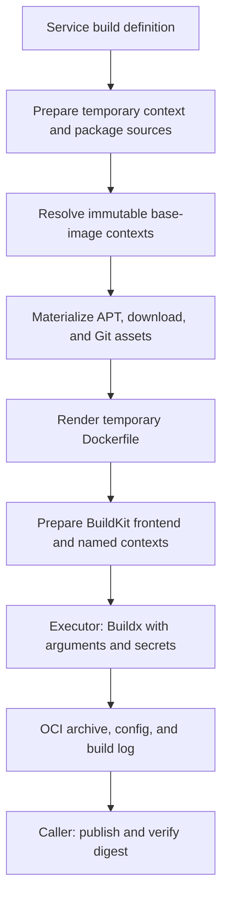

# Build engine

`build_engine` provides Dockerfile rendering, build-only dependency routing,
base-image resolution, BuildKit frontend preparation, and Buildx execution for
one service image. [`build_image()`](image_build.py) owns that complete process.
Its caller, [`service_images.py`](../service_images.py), decides when to build
and publishes the resulting archive.

## Why rendering exists

**Rendering primarily addresses network reliability during image builds.**
Task Dockerfiles often download packages, source repositories, release assets,
and base images from upstream services that are slow or intermittently
unreachable from the build environment. The goal is to route those downloads
to **equivalent, trusted sources with more reliable network access**, such as
approved mirrors, artifact caches, and dependency gateways.

Source substitution is intended to preserve the task's requested dependencies,
versions, repository revisions, and build behavior. Trust and content
equivalence are requirements when selecting replacement sources; successful URL
validation or network access alone does not establish either. The renderer is
not intended to upgrade dependencies or repair task logic.

Temporary Dockerfile/context transformations, package-source arguments, and
build-only Git/APT/download wrappers implement this routing. Original task
files and their identity remain unchanged. See the strategies below for the
supported substitutions and cases that retain the authored source.

## Inputs and outputs

The engine does **not** take a Bundle manifest, task definition, or CLI namespace.
The caller selects a service and passes its resolved build inputs to
`build_image()`:

- The original context directory and Dockerfile path.
- The platform, optional target stage, effective build arguments, and source settings.
- Network/cache options, a timeout, a temporary root, and a persistent log path.

The engine prepares the context, renders the Dockerfile, materializes runtime
assets, resolves named contexts, and invokes Buildx. It reads the resulting
OCI config and yields a `BuiltImage` containing `archive_path` and `config`.
The archive uses gzip layers with provenance disabled.

`build_image()` is a context manager. The caller must publish or copy the
archive inside the `with` block; all temporary inputs and the archive are
removed on exit, including preparation, build, metadata-reading, and caller
failures. The build log survives cleanup. The executor handles process-group
termination on timeout or interruption.

The caller publishes the archive through `registry.py` and verifies its remote
digest. Task preparation then assembles the [Bundle manifest](../task_bundle/README.md).
Compose parsing, task identity, Registry reuse decisions, publication, and
Sandbox startup are outside the build engine's responsibility.

## Modules and build lifecycle

| Module | Responsibility |
| --- | --- |
| `image_build.py` | Build one image, return its OCI config and archive, and own temporary artifact lifetime |
| `arguments.py` | Parse explicit build arguments and proxy settings |
| `base_images.py` | Resolve external base-image references into immutable named contexts |
| `dockerfile_renderer/renderer.py` | Render a temporary Dockerfile using dependency-source strategies |
| `dockerfile_renderer/strategies/apt/` | APT runtime strategy and its fixed shell/AWK assets |
| `dockerfile_renderer/strategies/download/` | curl/wget runtime strategy and its fixed shell/AWK assets |
| `dockerfile_renderer/strategies/packages.py` | Package-source validation, arguments, and context rewrites |
| `dockerfile_renderer/strategies/git.py` | Transient Git mirror configuration |
| `frontend/` | Prepare the instrumentation frontend and add build-only RUN mounts |
| `executor.py` | Execute Buildx, export the OCI archive, and manage process lifetime |

Dockerfile is the rendering target; APT, downloads, Git, and package sources
are strategies supporting that target. The APT and download modules each own
their wrapper and rewriter files at fixed module-relative paths. Asset paths
are not configurable. Source address validation is shared with Gateway routing
through [`source_urls.py`](../source_urls.py).

The following sequence is coordinated by `build_image()`:



Original task files remain unchanged. Temporary rendering and build context
changes affect the build inputs, while image identity remains derived from
the original static task environment. Frontend and runtime asset digests can
invalidate BuildKit cache without changing that identity.

For frontend source layout, instrumentation details, and development commands,
see the [BuildKit frontend README](frontend/README.md).

The surrounding task preparation layer can select all supported dependency
sources from a reachable `DEPENDENCY_GATEWAY_URL` before invoking this engine.
See [automatic Gateway routing](../README.md#automatic-gateway-routing) for
health checks, original-source fallback, and the separate OCI Registry path.

## Build-time inputs

`HARBOR_TASK_IMAGE_PUB_HOSTED_URL` and `HARBOR_TASK_IMAGE_JULIA_PKG_SERVER`
accept any build-reachable, query-free HTTP(S) package service. They become
the `PUB_HOSTED_URL` and `JULIA_PKG_SERVER` build arguments. Either may point
at a third-party mirror or a cache gateway. Empty leaves the ecosystem
default. Pip, npm, Go, Cargo, and Rustup use the same build-argument path and
are not part of APT interception. These arguments are not stored in the
published image.

When `HARBOR_TASK_IMAGE_GITHUB_MIRROR_URL` names a GitHub Smart HTTP mirror
prefix, preparation mounts a transient Git `url.*.insteadOf` config as
`/etc/gitconfig` for Dockerfile `RUN` commands. It covers clone, fetch, and
recursive submodules for HTTPS, SCP-like SSH, `ssh://`, and `git://` URLs.
The mount exists only during `RUN` and is not written into an image layer,
image environment, or global `.gitconfig`.

`HARBOR_TASK_IMAGE_BASE_IMAGE_REGISTRY` is one OCI registry/repository prefix
for logical unqualified names such as `FROM go_1.19.13`, and for
`docker.io`-qualified `FROM` lines. The host and a leading `library/` segment
are removed before lookup. Preparation pins the current manifest digest and
passes it as a BuildKit named context. The Dockerfile and its
environment-content identity stay registry-neutral. When the variable is
empty, unqualified public images continue through the configured Docker Hub
mirror. When it is set, a missing image fails the build. There is no mirror
fallback. One prefix applies to every resolvable external `FROM`, so use it
only when all of those base images live under it.

## APT and download interception

After Dockerfile lowering, the frontend adds the same BuildKit-only inputs to
every `RUN`:

```text
/run/opensandbox-apt/bin/apt
/run/opensandbox-apt/bin/apt-get
PATH=/run/opensandbox-apt/bin:$PATH
```

The [instrumentation frontend](frontend/README.md)
applies these options after upstream has handled shell and JSON forms,
heredocs, custom shells, and `RUN` options. Wrapper assets and the Gateway
root are content-addressed secrets. The shadow tree is tmpfs. The PATH change
and mounts do not persist in the stage environment or the final image.

On each intercepted invocation, the wrapper copies the current
`/etc/apt/sources.list`, `*.list`, and `*.sources` into the shadow tree,
rewrites active URIs, and runs the rootfs `/usr/bin/apt` or
`/usr/bin/apt-get` with that temporary view. Authored source files are not
changed.

After a successful `apt update` or `apt-get update`, the same invocation asks
APT for rewritten-source and original-source index targets with `apt-get
indextargets`. It joins targets by source entry and target metadata, then
copies package and release metadata to the filenames derived from the original
URI. Failure emits `event=index-reconciliation-failed` and fails the
invocation. No extra analysis or cleanup `RUN` is required.

When `HARBOR_TASK_IMAGE_DOWNLOAD_SOURCE_URL` is set, every credential-free
HTTP(S) APT repository URI becomes the route
`<root>/apt/v1/<scheme>/<hex-authority>/base/<hex-base-path>`. APT appends
`dists/...`, `pool/...`, and other repository paths. The Gateway reconstructs
the original upstream URL. There is no JSON override, source map,
per-repository registration, or built-in Ubuntu/Debian branch.

When the Gateway root is unset, APT sources keep their authored URLs. There is
no separate APT mirror option. A source with credentials or a query that
cannot be represented keeps its original URI, and the wrapper emits a bypass
warning before APT starts. The reported `source=` value strips userinfo,
query, and fragment:

```text
[harbor-task-image apt] WARNING event=source-bypass source=<uri> file=<source-file>
```

Non-HTTP(S) sources stay unchanged and do not warn. Absolute paths, PATH
resets, `env -i`, custom libapt frontends, and explicit custom APT layouts
can bypass interception.

The same root controls explicit Dockerfile downloads. The frontend then mounts
content-addressed `curl` and `wget` wrappers ahead of PATH for every `RUN`.
They encode each explicit HTTP(S) URL as
`<root>/download/v1/<scheme>/<hex-authority>/{root|object/<hex-path>}`.
Origin and path identities do not collide. This includes scripts created or
downloaded by an earlier command and executed in a later `RUN`, including
shell-expanded URLs. The root is an opaque cache URL. The manager does not
load a service-specific plan. Previously unseen origins and paths are accepted
on demand.

Only recognized invocation shapes are rewritten: `curl` with
quiet/fail/show-error/location short flags and an optional output file, and
`wget -q... -O FILE`. The wrapper is a whitelist, not a curl/wget parser.
IP literals, loopback aliases, single-label build-local names, internal
domains, URLs with a query or fragment, and curl-style `[]`/`{}` globs keep
the authored URL. Unknown options, request bodies, headers, credentials,
indirect configuration, proxy behavior, or output behavior the classifier
cannot preserve bypass the cache and run the real tool unchanged. Absolute
executable paths, PATH resets, `env -i`, and replacement binaries also bypass
the adapter.

> Task authors write ordinary `curl` and `wget` commands and do not construct
> Gateway routes. Operators do not expose the dynamic download endpoint to
> users or ordinary Sandboxes. The wrapper and source mount exist only during
> image-preparation `RUN` execution and do not persist in the image.

The frontend is built into a source-addressed local OCI cache. Its digest and
runtime asset IDs invalidate BuildKit `RUN` cache when a build occurs. They do
not change the static task-image identity. Frontend preparation failure
returns exit code 78 and stops new task dispatch for that batch. A fully
cached task batch does not prepare the frontend.
