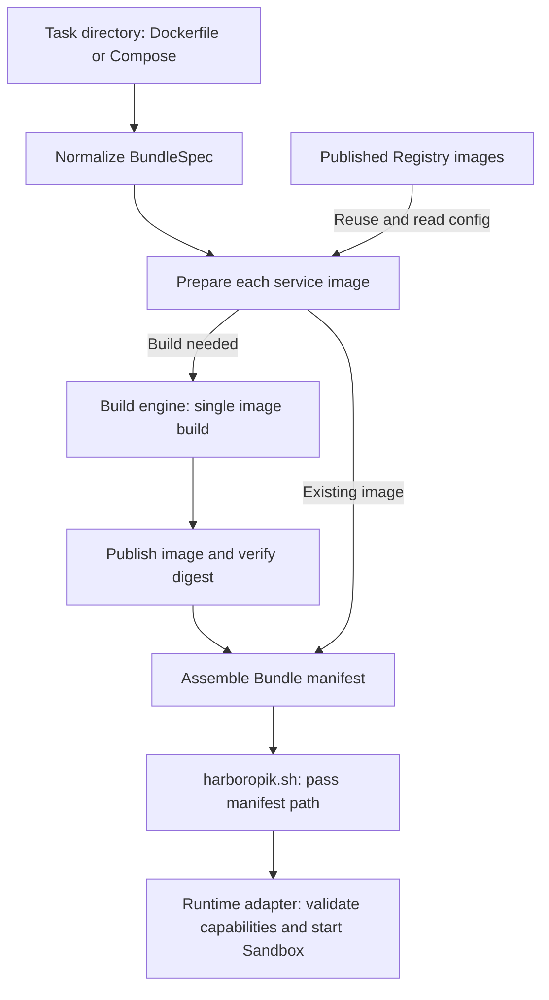

# Task Bundle: from task definition to runtime delivery

`task_bundle` defines the **task image Bundle** delivered to a runtime:
immutable service image references, runtime configuration, relationships, and
capability requirements. `PreparedBundle` holds the main image reference,
manifest contents, and optional path supplied by the caller.

`assemble_bundle_manifest()` combines an already-normalized task definition
and a mapping of service names to resolved image artifacts into a manifest
value. It assembles each service record internally, including runtime defaults
and task overrides; callers do not construct intermediate service manifests.
The artifact names must match the task's service names. These operations do
not build images, access a Registry, or read/write cache and manifest files.

The outer [`task_preparation.py`](../task_preparation.py) owns
`prepare_task_images()`: it prepares all service images, calls this module to
assemble the manifest, persists the result, and returns a `PreparedBundle`.
Dependency direction is from preparation to the Bundle abstraction. Bundle
code does not import the build engine, Registry client, or preparation workflow.

## One task, multiple services, one Bundle

A Bundle is the delivery unit for one task environment. A Dockerfile task is
normalized into one implicit `main` service. A Compose task can have multiple
services, each with its own image and runtime configuration. Both use the same
preparation workflow and manifest format.

**One Bundle manifest describes the entire set of services for a task.**
It is not a separate manifest per image. Different preparation results for the
same task can produce different Bundle manifests.

```text
Task Bundle
|-- main service name
|-- services
|   |-- main: immutable image digest reference + runtime configuration
|   `-- other services (optional): image references + runtime configuration
`-- task/environment identities, service relationships, capability requirements
```

## Relationship to Dockerfile, Compose, and OCI

| Object | Purpose | Lifecycle role |
| --- | --- | --- |
| Dockerfile | Image build instructions and default runtime configuration | Build input |
| Compose YAML | Service build/image sources, runtime overrides, dependencies, and environment requirements | Task environment definition |
| `BundleSpec` / `ServiceSpec` | Common in-memory task/service model normalized from Dockerfile or Compose | Preparation input |
| OCI image | Filesystem layers, image configuration, and content-addressed metadata | Built or reused image artifact |
| Bundle manifest | Final image references and the information needed to run the services | Runtime delivery output |

[`compose_bundle.py`](../../compose_bundle.py) parses the environment definition.
A service with `build` needs a build artifact; a service declaring `image` can
resolve and republish an existing image. The outer
[`service_images.py`](../service_images.py) produces the same
artifact record shape for both paths.

**A Bundle manifest and an OCI image manifest are different formats.** An OCI
image manifest identifies one image's config and layers. A Bundle manifest
references immutable image digests and combines OCI config defaults with task
runtime settings. It contains no image layers and does not implement all
Compose semantics. The runtime must still check capability requirements.

## Production and consumers



The manifest is produced during image preparation, whether images are newly
built or reused. The build engine receives a single service's build context,
Dockerfile, arguments, secrets, and related inputs; it does not consume the
final Bundle manifest.

The current runtime consumer is
[`yicloud_opensandbox.py`](../../yicloud_opensandbox.py). It reads image
references and runtime settings, checks capability requirements, and starts
services. [`harboropik.sh`](../../harboropik.sh) reads the main image reference
and passes the file path as `bundle_manifest_path`. The general format does
not imply that other Sandbox backends already consume it.

[`uploaded_bundle_cache.py`](../uploaded_bundle_cache.py) also consumes manifests: it validates the local uploaded
Bundle index and restores a `PreparedBundle` when reuse is allowed.

## Recovery after losing local files

The current runtime interface reads a local manifest file, so that path must
exist and be readable at startup. The file does not have to be kept forever as
the only copy, and builds are not tied to the machine that produced it.

After a successful prebuild, if the manifest or uploaded-Bundle cache is lost
when moving machines, run normal image preparation again:

1. Read the matching task directory to recover service definitions.
2. Query the target Registry for existing service images.
3. Validate task identity using the current rules and read image digests and OCI config.
4. Assemble and write a new local Bundle manifest for the runtime.

**Recovery requires both the task definition and accessible published images.**
Parsing the task directory alone cannot produce the final delivery manifest.
Matching images can be reused without rebuilding or passing `--force`.
A task/image mismatch fails default validation; recover the matching task
version or explicitly rebuild the updated task. Missing remote images may
trigger a build, so normal preparation is not a guaranteed read-only export.

Regeneration follows current image-selection and manifest-generation rules;
it does not guarantee a byte-for-byte historical copy. To preserve a specific
delivery result, retain its manifest and the images it references.

## Modules and boundaries

| Inside this package | Responsibility |
| --- | --- |
| `__init__.py` | Export `PreparedBundle` and `assemble_bundle_manifest` |
| `manifest.py` | Define the result type, derive runtime settings, compute Bundle identity, and assemble manifest data |

Operations belong to the surrounding image manager:

| External module | Responsibility |
| --- | --- |
| [`task_preparation.py`](../task_preparation.py) | Orchestrate preparation of one task and persist its final manifest |
| [`service_images.py`](../service_images.py) | Resolve, reuse, build, publish, and inspect one service image |
| [`task_image_identity.py`](../task_image_identity.py) | Hash original task inputs using the Harbor framework |
| [`uploaded_bundle_cache.py`](../uploaded_bundle_cache.py) | Validate/reuse uploaded-Bundle records and restore local manifest files |
| [`image_build_state.py`](../image_build_state.py) | Manage local image locks, records, and atomic JSON writes |
| [`oci.py`](../oci.py) | Read OCI archives, normalize image config, and handle image manifest media types |
| [`registry.py`](../registry.py) | Access remote images |

The preparation/cache behavior documented below describes those external
producers and consumers. It is not executable behavior owned by this package.

## Input normalization

| Task definition | Normalized result |
| --- | --- |
| `environment/Dockerfile` | One implicit service named `main` |
| `environment/docker-compose.yaml` or `.yml` | Named services; a `main` service is required |

The Compose loader accepts `build.context`, `build.dockerfile`, `build.args`,
`build.target`, `image`, `entrypoint`, `command`, `environment`, `ports`,
`expose`, aliases, `depends_on`, `healthcheck`, volumes, networks, `cap_add`,
and `privileged`. Build paths resolve inside the task environment. Unsupported
build fields fail before any image is built. The loader records requirements
such as multiple services, shared volumes, fixed IPs, multiple networks,
capabilities, and privileged execution. Recording a requirement does not mean
the runtime can satisfy it.

The loader is a restricted PyYAML reader. Compose merge, profiles, configs,
secrets, and other unlisted semantics are outside this contract.

## Identity and cache

Service image identity and Bundle identity are separate. Service identity is
the Harbor static environment-content hash. Bundle identity also includes the
resolved artifacts and runtime topology.

For a built service, image identity is the Harbor environment-content hash of
the original environment files. Preparation calls
`harbor.environments.definition.environment_content_hash()` and fails when that
API is unavailable. There is no local hash fallback.

Task-declared Compose build arguments and Dockerfile defaults are already part
of the static environment. Runtime build-argument overrides, package mirrors,
APT mirrors, base-image transport mirrors, proxies, fallback choices,
build-network settings, target platform, renderer version, and APT runtime
asset digest do not participate in image identity. The hash is the full
SHA-256, not a display truncation.

**P0 invariant:** image identity comes only from the original static task
environment. A dependency on rendering, rewriting, mounts, mirrors, runtime
assets, resolved artifacts, or any other build-time mutation is a P0 bug.

For an `image:` service, the task-declared reference is only the Harbor
empty-environment fallback seed. A resolved source manifest digest is build
evidence and does not change task identity. The image is republished so the
runtime receives a digest reference.

Registry addressing is:

```text
Project = benchmark
Repository = task identity (verbatim)
tag = <service>-<short-input-hash>
digest ref = <registry>/<project>/<task>@sha256:<artifact-digest>
```

The default repository name is the task directory name. It must already be one
legal OCI repository component. Preparation does not sanitize, truncate, or
append a hash. An invalid task identity has to be fixed by the dataset adapter.

`input_hash` is the full SHA-256 taken before build. `artifact_digest` comes
from an independent `skopeo inspect` after copy. The copy digest and the
inspect digest must match. Publication uses `skopeo copy --format v2s2`, which
is a Docker schema 2 manifest. The local build output is a gzip OCI archive at
`image.oci.tar`, with provenance disabled. Those are different media types:
the archive is the build product, and schema 2 is the published manifest.

On-demand preparation lists the task repository anonymously. A Harbor 401 or
403 retries once with `YICLOUD_HARBOR_USERNAME` / `YICLOUD_HARBOR_PASSWORD`, or
the existing Docker config when those variables are unset. Later inspection
uses the same credentials. Missing credentials or a failed authenticated query
stop preparation and do not trigger a rebuild. Public projects work without
credentials.

The selected tag is the repository's most recently pushed usable tag. By
default it must equal `<service>-<first 20 hex characters of the local hash>`.
A mismatch, or a tag without that encoding, stops preparation. It does not
select an older tag or rebuild. This checks the published tag prefix, not the
full remote config. Set `HARBOR_TASK_IMAGE_VALIDATE_HASH=0` or pass
`--no-validate-image-hash` to skip it. Only that opt-out warns that the local
task definition may differ from the remote image. `--validate-image-hash`
overrides the environment. An empty repository still uses the hash-based
build and push flow. This switch does not change uploaded-Bundle verification
or `--skip-hash-verification`.

Normal preparation treats the target task repository as the cache authority.
Dataset prebuild can also keep a local uploaded-Bundle index at
`<HARBOR_TASK_IMAGE_CACHE_ROOT>/uploaded-bundles/`. Entries are scoped by
Registry host, project, benchmark, platform, and the verbatim task repository.
They are written only after every service has resolved through the Registry
path. Image build locks and records live under `locks/images` and
`records/images` in that cache root, keyed by the repository and tag.

`UploadedBundleCache.try_restore()` owns cache reads, bypass rules, target and
content validation, and restoration to the requested manifest path. It returns
a `PreparedBundle` on a hit and `None` on a miss. Task preparation supplies a
lazy Bundle loader shared with the normal preparation path, so an attempt
parses the task at most once. Disabled, forced, and dry-run preparation bypass
cache reads. `store()` persists the completed Bundle under the same scope.

A later prebuild compares the current Bundle's definition identity and every
service's full static environment hash before reusing the recorded digest
references. That path does not log in or inspect the Registry. With
`HARBOR_TASK_IMAGE_PREBUILD_SKIP_HASH_VERIFICATION=1`, a structurally valid
entry for the same target and task identity is trusted before task parsing or
content hashing. That mode does not prove that the dataset is unchanged or
that the Registry still has the artifacts. It requires the local index.
Disable the index with `HARBOR_TASK_IMAGE_PREBUILD_USE_LOCAL_UPLOAD_CACHE=0`,
delete the local entry, or pass `--force` to resolve against the Registry
again. `--force` bypasses the tag lookup and the local index. It does not
change the tag or the content identity.

Fast resume returns before package-source health checks, so a batch made only
of local hits performs no per-task network request. A real miss still probes.
Source selection is shared by task and dataset preparation; see
[build source selection](../README.md#automatic-gateway-routing). A preparation
failure does not trigger source switching or a task restart.

Each Compose service keeps its own tag and artifact. This package does not
manage Registry projects, upload raw blobs, fall back to an old Registry, or
keep a cross-repository layer index.

Generated cache files are ignored by the environment hash. `.dockerignore` is
not applied, so a change to a file Docker would ignore can cause a rebuild.
It cannot cause reuse of a stale image.

`SkopeoPublisher` drops ambient HTTP(S) proxy variables for login, copy, and
inspect. `YICLOUD_HARBOR_TLS_VERIFY` controls TLS verification. Each publisher
uses a private temporary Skopeo auth file, removed after publishing. Parallel
prebuild workers do not share the XDG runtime auth file.

For a local build, the OCI archive config is read before the temporary archive
is discarded. Cache hits and external `image:` services use
`skopeo inspect --config`. Runtime ports and default commands come from that
config, not from a scan of the Dockerfile text.

## Bundle manifest

The JSON manifest contains:

- schema v2 `benchmark`, `task_identity`, and `registry` metadata;
- definition identity and Bundle identity;
- `main` and every named service;
- full `input_hash`, tag, tag ref, artifact digest, and digest ref;
- image config (`Entrypoint`, `Cmd`, `ExposedPorts`, healthcheck), Compose
  override presence, environment, ports, expose, aliases, dependencies, and
  healthcheck topology;
- materialized `runtime.start_argv`, `runtime.internal_ports`, and
  `runtime.readiness`, each with a source where one applies;
- volume, network, capability, and unsupported-feature requirements.

An implicit Dockerfile service uses the legacy keep-alive command
`sh -c 'while :; do sleep 60; done'` instead of the image `Cmd`. Compose
entrypoint and command overrides replace the image defaults under the Compose
rules recorded in the runtime source.

Build argument values are not written to the manifest or the local record.
Only their names are stored. Transport-only build arguments are not persisted.
Registry credentials and model credentials are not written to Bundle files.
