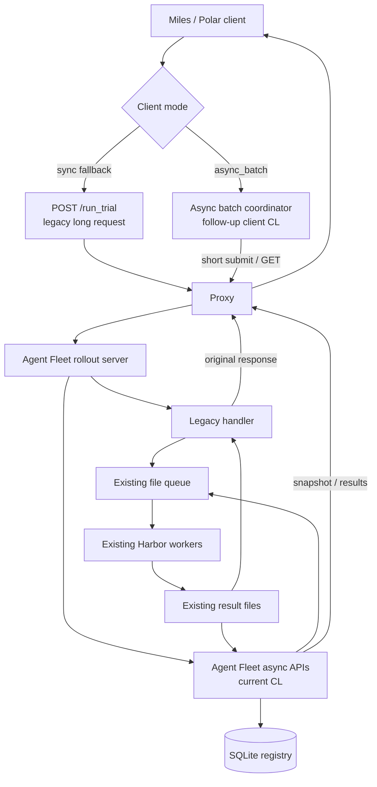

# Rollout 长运行操作控制面：异步 Trial Batch

作者：Miles / Polar / Harbor owners
状态：Draft
目标变更：Agent Fleet 服务端 MVP
最后更新：2026-07-14

## 摘要

一次 rollout trial 可能运行数分钟，但 HTTP 连接只是一次临时通信。现有 `POST /run_trial` 把两者绑定在一起：请求必须一直保持到 Harbor 执行、verifier 和结果写回全部结束。任何 Proxy timeout、连接重置或 client 重启都会让调用方失去结果，同时无法判断服务端是否已经接纳或完成任务。

本设计为 Agent Fleet 增加一个异步 batch 控制面：

```text
提交一组 trials
  -> 立即获得稳定的 batch / trial handles
  -> 通过短 GET 查询状态
  -> 通过可重复读取的 results API 取得已完成结果
```

当前变更（CL）建立的是**服务端正确性边界**，而不是完整切流：

- 用 SQLite 持久化 batch、trial、幂等映射和待入队意图；
- 提供异步提交、单 batch 状态、批量状态和结果读取 API；
- 复用现有文件队列、Harbor worker 和 `/run_trial` result shape；
- 默认关闭新接口，原 `/run_trial` 保持不变；
- 不修改 Harbor worker，也不在本 CL 中实现 Miles/Polar client。

它的核心价值是让“任务是否存在、执行到哪、结果在哪里”不再依赖某一条 HTTP 长连接。后续 client 接入后，Proxy timeout 将只影响一次通信，而不再决定 rollout 任务的生死。

## 术语

| 术语 | 含义 |
| --- | --- |
| Rollout trial | 针对一条任务执行一次 Harbor rollout |
| AsyncTrialBatch | 为减少提交和查询开销而形成的传输批次 |
| TrialExecution | batch 中一个可独立执行、独立完成的 trial |
| Control plane | 接纳请求、保存状态、查询进度和交付结果的部分 |
| Execution plane | 现有文件队列、Harbor worker、agent、verifier 和 reward 执行路径 |

AsyncTrialBatch 不是 Miles training batch、prompt group 或 rollout step。一个训练阶段可以产生多个 AsyncTrialBatch；同一 batch 内的 trials 仍然独立执行和返回。

## 背景

### 当前问题

同步路径在 Agent Fleet 内部已经使用队列和 worker，但 HTTP handler 仍会等待最终结果：

```text
Miles / Polar
  -> Proxy
  -> POST /run_trial
  -> Agent Fleet enqueue
  -> Harbor worker execution
  -> result
  -> 原 HTTP response
```

因此，队列等待、模型调用、工具调用和 verifier 的总时长仍然必须小于整条网络路径允许的最长请求时间。连接中断后，client 只能看到 timeout、EOF 或 5xx，无法区分：

- 请求尚未接纳；
- 已接纳并排队；
- 正在执行；
- 已完成但 response 丢失；
- 已失败。

如果 client 直接重发 `/run_trial`，服务端又没有稳定的幂等记录，同一逻辑 trial 可能被重复入队和执行。

### 目标架构



同步和异步路径共用 execution plane。差异只在控制面：

- Sync handler 在原请求上等待结果；
- Async handler 持久化接纳信息后返回 handle，后续请求只查询状态或读取结果。

## 目标

- 将 rollout execution lifetime 与 HTTP connection lifetime 解耦。
- 让已接纳任务拥有可持久化、可查询的 batch 和 trial handles。
- 让 response 丢失后的 submit retry 不会创建第二份逻辑 work。
- 用 batch submit 和批量 status GET 控制高并发下的控制面请求数量。
- 在 Agent Fleet 控制面进程重启后恢复已接纳记录和尚未完成的入队交接。
- 保持每个 trial 独立完成；一个慢 trial 不阻塞同 batch 已完成结果的交付。
- 复用现有 worker queue 和 result shape，缩小对 execution plane 的影响。
- 原样保留 `/run_trial` 作为兼容和回退路径。

## 非目标

- 不让单个 Harbor trial、模型推理或 verifier 执行得更快。
- 不改变 Miles 的 prompt grouping、replacement group 或 trainability 策略。
- 不自动补跑失败、过长或不可训练的 trial。
- 不保证 Harbor worker 崩溃后自动续跑正在执行的 trial。
- 不提供 cancellation、long polling、自动 retry 或 registry GC API。
- 不提供跨主机 active-active registry、透明 host failover 或分布式事务。
- 不替换现有文件队列、Harbor worker 或 result artifact。
- 不在当前 CL 中切换 Miles/Polar 流量。

## 预期收益

### 任务结果更明确

Client 拿到 `batch_id` 后，可以重新查询 `QUEUED`、`RUNNING`、`COMPLETED` 及每个 trial 的最终状态。通信失败不再自动等价于业务任务失败。

### Retry 更安全

相同 `request_id` 和相同规范化 payload 会返回原 admission response；相同 ID 携带不同 payload 会被拒绝。Client 可以恢复一次不确定的 submit，而不必盲目创建新 trial。

### 更适合更高并发

多个 trials 可以由一次短 submit 接纳，多个 active batches 可以由一次 GET 查询。控制面不再需要为每个 trial 长时间维持一条 HTTP connection。预期连接、handler 和 Proxy 资源主要由短请求并发决定，而不是由所有 active trials 的数量决定。

这不改变 Harbor worker、sandbox 或模型服务的执行容量；它移除的是控制面的一层扩展限制。

### 故障恢复更可控

Agent Fleet 重启后可以重新打开 registry，补齐已提交但尚未写入文件队列的 work，并从现有 queue/result 文件重新收敛状态。恢复依赖稳定 handle 和持久状态，而不是依赖原 socket 或进程内 `dict`。

### 改动范围受控

当前 CL 只修改：

- `async_trial_registry.py`：持久状态与幂等接纳；
- `rollout_remote_harbor.py`：异步 API、状态对账和结果交付；
- `RL-env.sh`：feature flag、registry 路径和 admission limits。

现有 worker 脚本、Harbor trial、`/run_trial` 和 Polar postrun 均不需要改变。

## 设计

### 核心约束

实现必须满足以下约束：

1. `202 Accepted` 对应一个已经持久化的 admission，而不是仅存在于内存中的任务。
2. 相同 `request_id` 与相同 payload 始终返回同一个 `batch_id` 和 trial mappings。
3. GET 请求只读取或对账状态，绝不创建新的 TrialExecution。
4. Batch 只是传输和查询单位，不改变单个 trial 的执行与结果所有权。
5. Terminal result 可以重复读取；读取失败不会触发重新执行。
6. Registry 状态只能单向前进，terminal trial 不会退回 `RUNNING` 或 `QUEUED`。
7. Legacy `/run_trial` 的 route、request、response 和行为保持不变。

### API

首版只提供完成 submit/status/results 闭环所需的四个 API：

| API | 语义 |
| --- | --- |
| `POST /async_trial_batches` | 持久化接纳一个有界 batch，返回稳定 handles |
| `GET /async_trial_batches/{batch_id}` | 立即返回一个 batch 的当前 snapshot |
| `GET /async_trial_batches?ids=...` | 一次读取多个 batch snapshots，降低轮询请求数 |
| `GET /async_trial_batches/{batch_id}/results` | 返回当前已经 terminal 的 trial results |

新 route 与 `/run_trial` 并列，表明它们执行同一种 Harbor trial，只采用不同的控制面语义。首版不引入 `/v1` 前缀，也不提供 wait、cancel 或 list-all API。

#### Submit

```http
POST /async_trial_batches
```

请求 envelope：

```json
{
  "request_id": "req-7d57...",
  "client_batch_id": "polar-batch-42",
  "trainer_run_id": "run-20260714",
  "batching_key": {
    "dataset_name": "seta",
    "ray_submission_id": "ray-job-17"
  },
  "trials": [
    {
      "client_trial_id": "session-001",
      "session_id": "session-001",
      "task_id": "97",
      "group_id": 97,
      "rollout_step": 0,
      "policy_version": 3,
      "payload": {
        "...": "existing /run_trial request fields"
      }
    }
  ]
}
```

`trials[].payload` 复用现有 `/run_trial` request shape。Batch envelope 只增加稳定身份、批次信息和可共享的 routing defaults。

成功响应：

```http
202 Accepted
```

```json
{
  "batch_id": "atb-<uuid>",
  "name": "async_trial_batches/atb-<uuid>",
  "state": "QUEUED",
  "revision": 1,
  "requested_trials": 1,
  "trials": [
    {
      "client_trial_id": "session-001",
      "trial_execution_id": "te-<uuid>",
      "state": "QUEUED"
    }
  ]
}
```

#### Status

单 batch GET 返回 compact snapshot：

```json
{
  "batch_id": "atb-<uuid>",
  "state": "RUNNING",
  "revision": 4,
  "requested_trials": 32,
  "queued_trials": 8,
  "running_trials": 12,
  "succeeded_trials": 10,
  "failed_trials": 2,
  "result_manifest_uri": "/async_trial_batches/atb-<uuid>/results"
}
```

批量 GET 接受多个 IDs，返回 `batches` 和 `missing_ids`。两种 GET 都立即返回 snapshot，不等待状态变化。

#### Results

`GET /async_trial_batches/{batch_id}/results` 可以在 batch 尚未完成时调用，只返回当前已经进入 `SUCCEEDED` 或 `FAILED` 的 trials：

```json
{
  "batch_id": "atb-<uuid>",
  "state": "RUNNING",
  "terminal_trials": 2,
  "available_results": 2,
  "results": [
    {
      "client_trial_id": "session-001",
      "trial_execution_id": "te-<uuid>",
      "state": "SUCCEEDED",
      "result": {
        "...": "existing /run_trial response body"
      }
    }
  ]
}
```

Result endpoint 读取 Agent Fleet 本地 artifact，并通过 HTTP 返回兼容的 result body。Client 不需要直接访问 Harbor 主机上的文件路径。

### 生命周期

一次异步提交按以下顺序执行：

1. **完整校验。** 服务端先校验 batch envelope、每个 trial、routing 信息、重复 IDs 和 admission limits，不写入任何持久状态。
2. **原子接纳。** 一个 SQLite transaction 同时写入幂等记录、AsyncTrialBatch、TrialExecution 和 enqueue intents。
3. **物化入队。** 服务端把每个 enqueue intent 原子写入现有 `pending` 文件队列，并标记 intent 已物化。
4. **返回 handle。** Submit 返回持久化的 batch/trial mappings，HTTP 请求结束。
5. **执行。** 现有 worker 从 `pending` claim 到 `active`，运行 Harbor，并将结果写入 `results`。
6. **状态对账。** Status 或 results GET 根据 `pending/active/results` 文件更新 registry snapshot。
7. **结果交付。** Client 按 `client_trial_id` 将 terminal result 路由回对应 Polar session。

Worker 不直接写 SQLite。这样可以保持现有 execution plane 不变；registry 在 startup 和读取请求到来时与文件队列收敛。

### 状态模型

TrialExecution 状态：

```text
QUEUED -> RUNNING -> SUCCEEDED
                  -> FAILED
QUEUED ----------> SUCCEEDED | FAILED
```

允许从 `QUEUED` 直接观察到 terminal state，因为控制面可能在 worker 完成后才第一次对账。

AsyncTrialBatch 状态：

```text
QUEUED -> RUNNING -> COMPLETED
QUEUED ----------> COMPLETED
```

`COMPLETED` 只表示所有 trials 都已 terminal，不表示全部成功。普通 trial failure 通过 counters 和 results 表达，不会把整个 batch 变成一个不可解释的全局失败。

### 持久化与状态所有权

SQLite registry 与文件队列承担不同职责：

| 信息 | 权威存储 |
| --- | --- |
| `request_id`、canonical digest、原 admission response | SQLite registry |
| Batch / trial IDs、状态、revision 和 counters | SQLite registry |
| 尚未完成的 queue handoff | SQLite enqueue intent |
| Worker 的 `pending/active/results` 状态 | 现有文件队列 |
| Harbor terminal result body | 现有 result artifact |
| HTTP connection | 非权威、可随时重建 |

SQLite 解决跨多条记录的原子提交和进程重启后的重新打开；文件队列继续解决 worker claim 与 result handoff。把二者强行合并会扩大 worker 改动，却不会增加首版所需的控制面语义。

Registry 使用 Python 标准库 `sqlite3`，文件位于现有 run/queue root。首版假设单个 Agent Fleet service writer 和可靠本地磁盘，不承诺共享 NFS 或多主机 active-active。

### 幂等语义

```text
request_id 不存在
  -> 创建 batch、trials、enqueue intents 和原 admission response

request_id 已存在，canonical payload 相同
  -> 返回原 admission response，不再次入队

request_id 已存在，canonical payload 不同
  -> 409 Conflict
```

Client 必须在第一次 submit 前保存 `request_id`，并在 timeout、EOF 或 5xx 后复用该 ID。Retry 时生成新 ID 会绕过去重边界。

该设计保证幂等接纳和单一 authoritative result mapping，不宣称底层 worker 在所有故障下严格 exactly-once。

### Crash 边界

| 故障位置 | 恢复语义 |
| --- | --- |
| Registry commit 前 | 没有 admission；相同请求可以正常创建 |
| Commit 后、response 前 | Retry 返回原 handles |
| Commit 后、queue file 前 | Startup reconciliation 根据 enqueue intent 补齐文件 |
| Queue/result 已存在 | Registry 从文件状态重新收敛 |
| 已物化的 queue artifact 消失 | Trial 标记为明确失败，不盲目重复执行 |

这里的“恢复”是恢复控制面身份、状态和尚未完成的 queue handoff，不等于自动续跑被杀死的 Harbor worker。透明 worker retry 需要独立的执行策略和幂等边界。

### 错误语义与限制

| 情况 | HTTP 结果 |
| --- | --- |
| 新接纳或幂等恢复 | `202 Accepted` |
| 无效 batch、trial 或 routing payload | `400 Bad Request` |
| 相同 `request_id` 携带不同 payload | `409 Conflict` |
| Batch 不存在 | `404 Not Found` |
| Request body 超限 | `413 Request Entity Too Large` |
| Registry 或 result delivery 内部错误 | `500 Internal Server Error`，带稳定 category |

首版限制单 batch trial 数、request body 大小和一次 bulk status IDs 数量。这些是内部服务的可靠性边界，不是租户配额或完整限流系统。

## 为什么不只调长 Proxy Timeout

调长 timeout 可以作为临时缓解，但不能建立任务语义：

| 问题 | 调长 timeout | 异步控制面 |
| --- | --- | --- |
| 超过新阈值的任务 | 再次失败 | 任务不依赖固定连接时长 |
| 断线后状态不明 | 不解决 | 通过稳定 handle 查询 |
| Submit retry 重复执行 | 不解决 | 持久化幂等 admission |
| 每个 active trial 一条长连接 | 不解决 | batch submit + compact GET |
| 控制面进程重启 | 原连接中断 | registry 和 queue 可重新收敛 |

本设计不是为了选择一个更大的 timeout 数字，而是把任务生命周期从通信通道中分离出来。即使部署同时调大 timeout，异步 handle、幂等性和可重复读取结果仍然有独立价值。

## 向后兼容与发布

- `RL_ASYNC_TRIAL_BATCHES_ENABLED=0` 为默认值；关闭时新 route 返回 404。
- `/run_trial` 不改名、不改 request/response，也不受 async admission limits 影响。
- Agent Fleet 可以同时提供同步和异步 route。
- 后续 Miles/Polar client CL 将增加 shared batch coordinator 和显式 client mode。
- Async client 出现问题时可以切回 `/run_trial`，不需要删除新 registry 或改变 worker。
- 在 client 接入前，当前 CL 不改变任何现有训练流量。

`/health` 在 async mode 下报告 registry readiness、queue depth 和配置 limits，便于判断服务是否具备接纳条件。它不返回 request payload、API key 或 result 内容。

## 安全与隐私

- Client 提供的 API key 不进入持久化 async payload；执行凭证由 Agent Fleet 服务端配置。
- Error、status、health 和 results response 不回显 authorization 等敏感字段。
- Batch size、request bytes 和 bulk IDs 都有明确上限。
- Registry 和 result files 沿用 Agent Fleet run root 的访问控制。
- 新 route 复用现有 listener 和 Proxy，不新增端口；本设计也不替代现有认证策略。

## 风险与后续工作

| 项目 | 当前处理 |
| --- | --- |
| Miles/Polar 尚无 async client | 后续 CL 实现 coordinator、polling 和 per-session result routing |
| SQLite 是单主机存储 | 首版限定单 writer、本地可靠磁盘；分布式部署需替换 backend |
| Polling 可能产生额外请求 | 使用 batch handles、bulk status、上限和 client-side jitter |
| Registry 与 results 会持续增长 | 首版跟随 run storage 生命周期；retention/GC 独立设计 |
| Active worker 故障不会自动续跑 | 返回明确 terminal failure；retry policy 独立设计 |
| 首版没有 cancellation | 不把 disconnect 解释为 cancel；需要时另行设计显式语义 |

## 备选方案

### 保持同步接口并增加 timeout

改动最小，但只推迟失败点，仍然缺少稳定 handle、幂等 retry 和可查询结果。

### 只使用内存 registry

可以缩短 HTTP request，却无法跨 Agent Fleet 进程重启保存 admission 和幂等映射，不满足 `202 Accepted` 的持久语义。

### 每个 trial 一个异步 job

能够解耦连接，但高并发时提交和轮询请求数仍与 trial 数量同阶。AsyncTrialBatch 在保持 trial 独立性的同时提供批量传输和查询。

### 首版引入外部数据库或 workflow engine

可以支持更复杂的多主机调度，但会显著扩大部署和迁移范围。当前 execution plane 已经存在，首版只需要在单 Agent Fleet 实例内补齐 durable control-plane semantics。

## 决策

采用 feature-flagged AsyncTrialBatch 控制面，并保留 legacy `/run_trial`。

当前 CL 先完成 Agent Fleet 服务端的 durable admission、幂等映射、状态查询和结果读取。Miles/Polar client 在后续 CL 接入。这个拆分让服务端契约可以独立评审，同时不提前改变现有训练路径。

设计语义参考 [Google AIP-151: Long-running operations](https://google.aip.dev/151)，但 route 和 wire format 保持项目本地、最小化，并不实现完整 Operations API。
