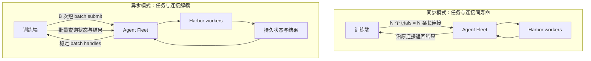

# Rollout 异步控制面验证报告

状态：**Conditional Go**  
测试日期：2026-07-10 至 2026-07-14  
验证分支：`feature/async-trial-batches`  
最终生命周期与故障注入复测版本：`0f23c60`

## 1. 执行摘要

现有 `/run_trial` 将一个 rollout trial 绑定到一条 HTTP 长连接。真实运行中已经出现超过 Proxy
时限的任务，并最终返回 `504 Gateway Time-out`。调长 Proxy timeout 可以暂时减少这类错误，但不会解决
长连接资源占用、断线后状态不明或重试导致重复执行的问题。

本轮测试表明，异步 batch 控制面具有独立于 Proxy timeout 的整体收益：

| 核心问题 | 测试结论 |
| --- | --- |
| 是否牺牲执行能力 | 128-trial 等工作量实验保留了 Sync `99.8%` 的 synthetic completion throughput |
| 是否降低连接资源 | 128 个长请求降为 4 个短 batch submit；峰值 threads/TCP 从 `128/128` 降至 `1/1` |
| 断线重试是否安全 | 100 次 response-loss retry 中，Sync 实际执行 198 次，Async 执行 100 次 |
| 状态和结果能否恢复 | queued、running、mixed-terminal、terminal 四种重启边界全部通过 |
| 扩展到更大规模是否失控 | 1280 个 synthetic trials 全部完成；峰值 threads/TCP 为 `30/30`，没有随 trials 增长到 1280 |
| 是否已可生产切换 | 否；真实 Proxy 长尾、真实 Harbor E2E、Miles/Polar client 和 4 小时 soak 尚未完成 |

**结论：** 当前证据足以支持继续实现 Miles/Polar async client，并保留 `/run_trial` 作为默认和回退路径；
不足以支持生产默认切换或宣称真实训练吞吐提升。

## 2. 问题与方案

这里的“控制面”只负责接收 rollout、记录状态和交付结果，不代表模型推理或 Harbor 执行本身。
一个 trial 表示针对一条任务执行一次 rollout；一个 batch 是一次提交的多个 trials；Agent Fleet 是接收
这些请求并调度 Harbor 执行的 rollout 服务。

Async 并不让单个 trial 执行得更快。它改变的是任务管理方式：提交成功后立即返回稳定 handle，后续连接
可以断开、重建和重试，而任务状态与结果仍然存在。

## 3. 测试边界

测试刻意隔离了控制面与真实 workload，避免把模型、sandbox 或 reward 的波动误判为协议差异。

| 范围 | 本轮是否真实执行 |
| --- | --- |
| Agent Fleet HTTP handler、SQLite registry、文件队列、状态查询、结果交付 | 是 |
| TCP 连接、Linux thread/FD/RSS、服务进程 kill/restart | 是 |
| Harbor agent、sandbox、模型推理、reward | 否，由 deterministic synthetic worker 替代 |
| Miles/Polar async client | 否，尚未实现 |
| 真实 Proxy 下的新 async 路径 | 否 |

因此，本报告可以评价控制面正确性、故障恢复和资源扩展趋势，但不能评价真实模型速度、训练吞吐或生产
最大并发量。

下文中，logical request 表示一次应当只执行一次的业务请求；worker claim 表示 worker 真正领取并开始
执行一次 trial。两者的差值用于识别重复执行。

## 4. 测试结果

### 4.1 相同工作量下的资源成本

128 个 trials 均执行 30 秒。Sync 发出 128 个 `/run_trial` 请求；Async 以 batch size 32 发出 4 个
短提交。两组都完成 128 次 worker claim 和 128 个结果。

| 指标 | Sync | Async |
| --- | ---: | ---: |
| Admission HTTP requests | 128 | 4 |
| Completed trials | 128 | 128 |
| Wall time | 35.391s | 35.507s |
| Completion throughput | 3.656 trials/s | 3.649 trials/s |
| Peak handler threads | 128 | 1 |
| Peak established TCP | 128 | 1 |
| Peak open FDs | 128 | 4 |
| Peak RSS increase | 5088 KiB | 1304 KiB |
| Connection-seconds | 3843.822 | 0.445 |

Async/Sync completion throughput ratio 为 `0.998`。资源下降没有以减少已完成工作为代价。

该 A/B 的 Async admission requests 和 connection-seconds 只计算短提交；完整 status/results 生命周期由
后续容量实验覆盖，不能把 `4` 个请求或 `0.445` connection-seconds 当作完整训练周期的总网络成本。

在更尖锐的瞬时 burst 中，Sync 只成功接纳 `104/128` 个请求并出现 24 个 transport errors；Async 的
4 个 batch submissions 全部成功并完成 128 个 trials。该结果证明 per-trial connection fanout 对瞬时接纳
压力敏感，但不代表生产环境固定会有 18.75% 的失败率。

### 4.2 响应丢失与重复提交

每组包含 100 个 logical requests。实际执行次数通过 worker queue claim 统计，而不是只看最终结果文件。

| 场景 | 模式 | Logical requests | Actual executions | Duplicate executions | Amplification |
| --- | --- | ---: | ---: | ---: | ---: |
| Response lost, then retry | Sync | 100 | 198 | 98 | 1.98x |
| Response lost, then retry | Async | 100 | 100 | 0 | 1.00x |
| 8 concurrent duplicate clients | Sync | 100 | 143 | 43 | 1.43x |
| 8 concurrent duplicate clients | Async | 100 | 100 | 0 | 1.00x |

Response-loss retry 是更贴近现实的场景：客户端只看到 timeout、EOF 或 connection reset，无法判断服务端
是否已经接纳。Sync 重试几乎使执行翻倍；Async 用同一 request ID 返回原 batch，不再进入第二次执行。
当前 remote Harbor client 尚未自动 retry；本实验验证的是未来能否安全恢复，不代表生产中已经出现 98%
的重复执行率。

8-client 并发重复不是当前单 scheduler 的常规流量，而是对原子幂等性的故障注入。它证明多个恢复动作
发生竞争时，仍只会创建一次逻辑执行。

### 4.3 完整生命周期与容量扩展

以下实验均使用 batch size 32、执行容量 60，并在 mixed-terminal 状态强制 kill/restart Agent Fleet
控制面进程。每轮还注入 submit/status/result response loss、并发重复提交和超限 admission；这里没有
模拟真实 Harbor worker 自身崩溃。

| 指标 | 320 trials | 640 trials | 1280 trials |
| --- | ---: | ---: | ---: |
| Batch handles | 10 | 20 | 40 |
| Terminal/queryable results | 320/320 | 640/640 | 1280/1280 |
| Unknown outcomes | 0 | 0 | 0 |
| Lost results | 0 | 0 | 0 |
| Duplicate executions/results | 0 | 0 | 0 |
| Status wire requests | 21 | 55 | 76 |
| Status latency p95 | 93ms | 187ms | 223ms |
| Recovery time p95 | 0.757s | 1.835s | 1.467s |
| Peak handler threads | 12 | 29 | 30 |
| Peak established TCP | 11 | 29 | 30 |
| Peak RSS increase | 6.6 MiB | 14.1 MiB | 17.3 MiB |
| HTTP 502/504 on direct path | 0 | 0 | 0 |

Status wire requests 包含计划内断线和服务重启期间的 retry，因此用于表示实际控制面请求成本，不等同于稳态
轮询频率。

从 640 扩展到 1280 时，trials 翻倍，但峰值 threads/TCP 基本不变，说明连接资源由 batch submission
concurrency 控制，而不是由 active trials 数量控制。Status p95 增至 223ms，但没有线性翻倍；所有结果
仍能恢复。

这些数字证明 1280-trial synthetic capacity case 可运行，不代表 1280 是典型生产并发量或系统上限。

### 4.4 Batch size 取舍

固定 320 个 trials，仅改变控制面 batch size：

| Batch size | Batch handles | Status latency p95 | Result wire requests | Unknown/lost/duplicate |
| ---: | ---: | ---: | ---: | ---: |
| 8 | 40 | 234ms | 48 | 0/0/0 |
| 16 | 20 | 121ms | 24 | 0/0/0 |
| 32 | 10 | 93ms | 12 | 0/0/0 |
| 64 | 5 | 71ms | 6 | 0/0/0 |

较大的 batch 明显减少查询和结果交付成本。单看 Agent Fleet，64 最省控制面资源；但本轮没有测量 client
batching delay、首批等待或真实 rollout 时长分布。现阶段建议将 **32 作为保守默认候选**，64 作为高并发
调优值，在 Miles/Polar E2E 后再决定。

### 4.5 重启与兼容性

| 重启边界 | 预期风险 | 结果 |
| --- | --- | --- |
| Queued | 已接纳任务在 worker 启动前丢失 | PASS，32/32 结果可取，无重复 claim |
| Running | 控制面重启后无法识别 active trials | PASS，状态重新收敛，无重复执行 |
| Mixed-terminal | pending、active、result 并存时恢复错误 | PASS，全部状态和结果一致 |
| Terminal | 服务端已完成但 client 尚未取回结果 | PASS，lost result 为 0 |

改造后的 legacy smoke 同时通过：`/run_trial` 和 Async 均完成 32/32 trials，证明现有同步接口没有协议回归。

## 5. 为什么不只调长 Proxy Timeout

调长 timeout 可以作为紧急缓解措施，但只能延后断线时间：

| 问题 | 调长 timeout | Async control plane |
| --- | --- | --- |
| 超过固定时限的任务 | 只能覆盖新的上限 | 任务生命周期不依赖单条连接 |
| Per-trial threads/TCP | 不解决 | 降为短 batch submit 和批量查询 |
| 响应丢失后状态不明 | 不解决 | 可用稳定 handle 查询 |
| Retry 重复执行 | 不解决 | 持久化幂等 admission |
| 服务重启后的结果恢复 | 不解决 | 状态和结果可重新收敛、读取 |

因此，增加 Proxy timeout 可以保留为运维兜底，但不能替代控制面改造。

## 6. 已证明与未证明

### 已证明

- Async 显著降低 per-trial 长连接带来的 thread、TCP、FD 和 connection-time 成本。
- 在相同 synthetic workload 下，Async 没有降低 completion throughput。
- Response loss 和并发 retry 不会产生第二次 queue claim。
- 已接纳任务和 terminal results 在多种 Agent Fleet 控制面重启边界后仍可恢复。
- 控制面完成了 1280-trial synthetic capacity case，连接资源没有随 trials 同阶增长。
- Legacy `/run_trial` 仍可正常工作。

### 尚未证明

- 真实 Harbor、模型推理、reward 或训练吞吐得到提升。
- 新 Async 路径穿过生产 Proxy 后，360-420 秒长尾任务仍无 502/504。
- 4 小时以上持续运行不存在 thread、FD、RSS 或 registry 增长问题。
- Miles/Polar 重启后能够从持久化 handle 恢复训练协调状态。
- 当前测试规模是生产最大容量或典型并发量。

## 7. 决策

| 决策项 | 结论 |
| --- | --- |
| 继续实现 Miles/Polar async client | **GO** |
| 将 Async 设为生产默认 | **NO，等待 E2E 与 soak** |
| 删除或改写 `/run_trial` | **NO，原样保留作为兼容和回退路径** |
| 仅通过调长 Proxy timeout 关闭问题 | **NO，只能作为临时缓解** |

下一阶段必须完成真实 Proxy 长尾、真实 Harbor 小规模与目标规模 E2E、4 小时 soak，以及 Miles/Polar
结果映射和回退验证。通过这些门禁前，本报告结论保持 **Conditional Go**。
